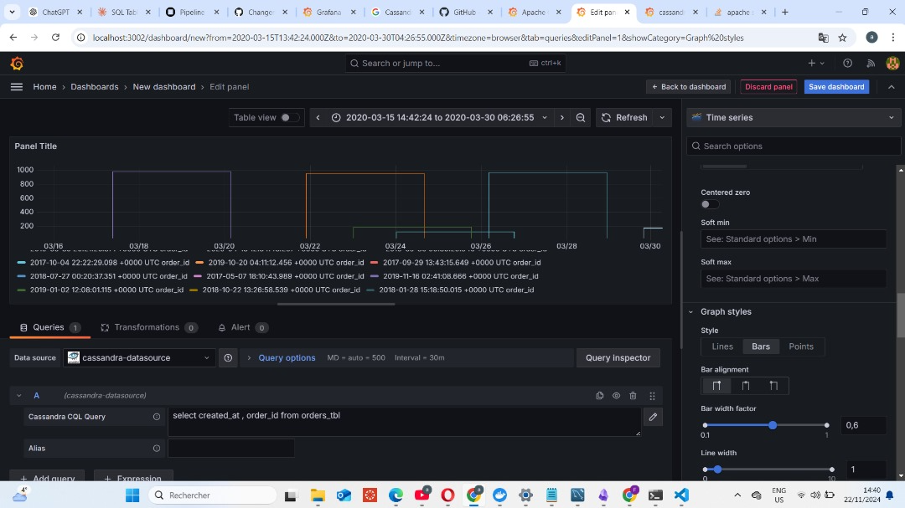

# Projet : Analyse des transactions de ventes avec Kafka, Spark Streaming, Cassandra, MySQL et Grafana

## Description
Ce projet a pour but d'analyser un jeu de données de transactions de ventes provenant de Kaggle en utilisant une architecture de traitement de données en temps réel. L'ingestion des données se fait avec Kafka, le traitement avec Spark Streaming, tandis que les données brutes sont archivées dans Cassandra et les données agrégées dans MySQL. Les tableaux de bord interactifs sont créés avec **Grafana** pour permettre la visualisation des KPI en temps réel.

## Technologies utilisées
- **Kafka** : pour l’ingestion des données en temps réel.
- **Spark Streaming** : pour le traitement des flux de données.
- **Apache Cassandra** : pour l’archivage des données brutes.
- **MySQL** : pour le stockage des données agrégées.
- **Grafana** : pour la visualisation des données et le suivi des KPI en temps réel.

## Pipeline d’ingestion et de traitement
1. **Ingestion des données avec Kafka** :
   - Les transactions de ventes sont envoyées en flux continu vers Kafka, permettant une ingestion rapide et continue des données.
   
2. **Traitement en temps réel avec Spark Streaming** :
   - Spark Streaming effectue un traitement en temps réel des flux de données, incluant le nettoyage, la transformation et l'agrégation des données pour obtenir des informations utiles (par exemple, ventes totales par produit, par région, etc.).
   
3. **Archivage des données brutes** :
   - Les données non transformées et brutes sont stockées dans **Apache Cassandra** pour garantir une haute disponibilité et une scalabilité horizontale.
   
4. **Stockage des données agrégées** :
   - Les données agrégées, une fois traitées, sont stockées dans **MySQL** pour permettre une récupération rapide et des requêtes analytiques.

## Visualisation des KPI avec Grafana
- **Grafana** est utilisé pour créer des tableaux de bord interactifs qui affichent des indicateurs clés de performance (KPI) en temps réel :
  - **Produits les plus vendus** : afficher les produits ayant généré le plus de ventes sur une période donnée.
  - **Pics de ventes** : visualiser les périodes avec un nombre élevé de ventes (heures, jours, semaines).
  - **Performances par catégorie** : analyser les tendances de ventes par catégorie de produit.
  
- Grafana se connecte directement à **MySQL** pour extraire les données agrégées et afficher des graphiques interactifs. Des alertes peuvent également être configurées pour prévenir en cas de variations inattendues des ventes.

## Objectifs
- Fournir une solution de traitement en temps réel des transactions de ventes.
- Créer une visualisation claire et interactive des données permettant aux décideurs de suivre les performances des ventes instantanément.
- Garantir une architecture scalable, efficace et facile à maintenir.

## Résultats attendus
- Une analyse en temps réel des transactions de ventes et des visualisations pertinentes via Grafana.
- Une base de données centralisée contenant des données brutes et agrégées accessibles pour des analyses futures.
- La capacité à prendre des décisions éclairées grâce à des indicateurs visuels et des alertes automatisées.

<!-- SETTING UP APPLICATION IN YOUR PC -->

docker compose up -d 

<!-- SETTING UP CASSANDRA SCHEMA -->
## CASSANDRA SCHEMA 

cqlsh

CREATE KEYSPACE IF NOT EXISTS weather WITH replication = {'class':'SimpleStrategy', 'replication_factor' : 1};

CREATE KEYSPACE IF NOT EXISTS weather 
WITH replication = {'class': 'SimpleStrategy', 'replication_factor': 3};

USE weather;

CREATE TABLE weather_data (
    location_name TEXT,
    region TEXT,
    country TEXT,
    latitude FLOAT,
    longitude FLOAT,
    localtime TIMESTAMP,
    temperature_c FLOAT,
    temperature_f FLOAT,
    condition_text TEXT,
    condition_icon TEXT,
    humidity INT,
    wind_mph FLOAT,
    wind_kph FLOAT,
    pressure_mb FLOAT,
    feelslike_c FLOAT,
    feelslike_f FLOAT,
    is_day BOOLEAN,
    last_updated TIMESTAMP,
    precipitation_mm FLOAT,
    formatted_time TIMESTAMP,
    day_or_night TEXT,
    PRIMARY KEY (location_name, localtime)
);

SELECT * FROM weather_data;

<!-- SETTING UP MYSQL DATABASE -->

CREATE DATABASE IF NOT EXISTS sales_db;
 
 use sales_db;
 
CREATE TABLE total_sales_by_source_state (
    source VARCHAR(100),
    state VARCHAR(100),
    total_sum_amount DECIMAL(10,2),
    processed_at DATETIME,
    batch_id INT
);

<!-- CONNECT CASSANDRA TO GRAFANA -->

docker network create shared_network

docker network connect shared_network <container_name_of_service1_CASSANDRA>

docker network connect shared_network <container_name_of_service2_GRAFANA>

<!-- RESULTS -->
